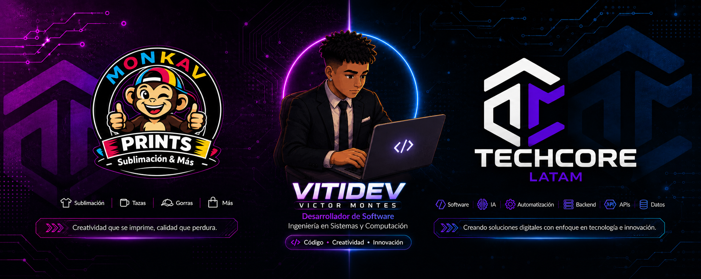

 

# 𝑯𝒆𝒍𝒍𝒐, 𝑰'𝒎 **Victor Montes(VITIDEV)** 👋

### `Systems Engineer` · `Software Developer` · `Tech Entrepreneur`

 

### 🏢 Co-Founder of **[TECHCORE LATAM](https://www.techcorelatam.com/)**

I'm a **software developer and technology enthusiast** passionate about building things from scratch, exploring new technologies and turning ideas into real-world solutions. I enjoy working with **software development, AI, automation and modern technologies**, while constantly learning and challenging myself through new projects.

 

## `👾 About Me`

I'm **Victor Montes(VITIDEV)**, a Systems Engineering student and software developer from Panama, known online as **VITIDEV**.

* 🚀 **Current Focus:** Building full-stack applications, AI-powered solutions, automations and digital products, while constantly exploring new technologies.
* 💻 **Development:** I work mainly with **Python, Django, FastAPI, React, Next.js, TypeScript, PostgreSQL and REST APIs**, with a strong interest in backend and full-stack development.
* 🤖 **AI & Automation:** Exploring **LLMs, AI APIs, agents and workflow automation** using tools like **n8n, Make and Zapier**.
* 🏢 **Entrepreneurship:** **Co-Founder of TECHCORE LATAM**, where we build software, SaaS, AI solutions, web applications and business automations.
* 🎓 **Academic Background:** Currently pursuing a **Bachelor's Degree in Systems and Computing Engineering** at the **Universidad Tecnológica de Panamá (UTP)**.
* 🌱 **Always Learning:** I enjoy turning what I learn into **real-world projects**, experimenting with new technologies and building things from scratch.

## ⚡ `My Weapons of Choice`

  
    

  
  
  
  
  

## 🔥 `GitHub Streak`

  

## 🌐 `Let's Connect`

  
  
  
  
  

